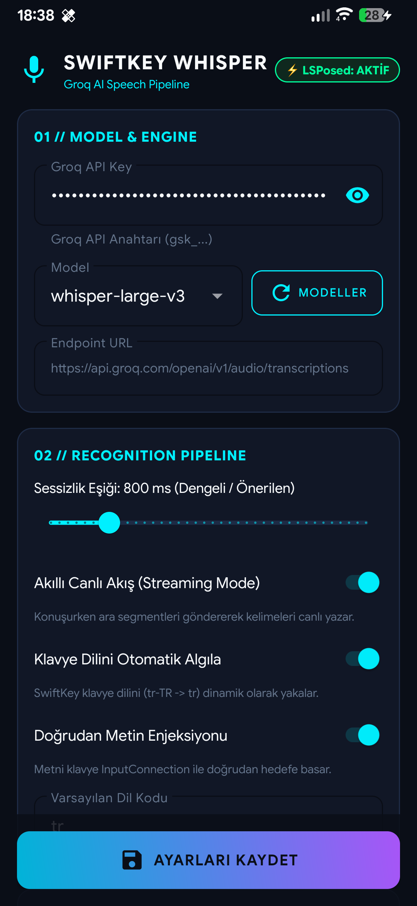
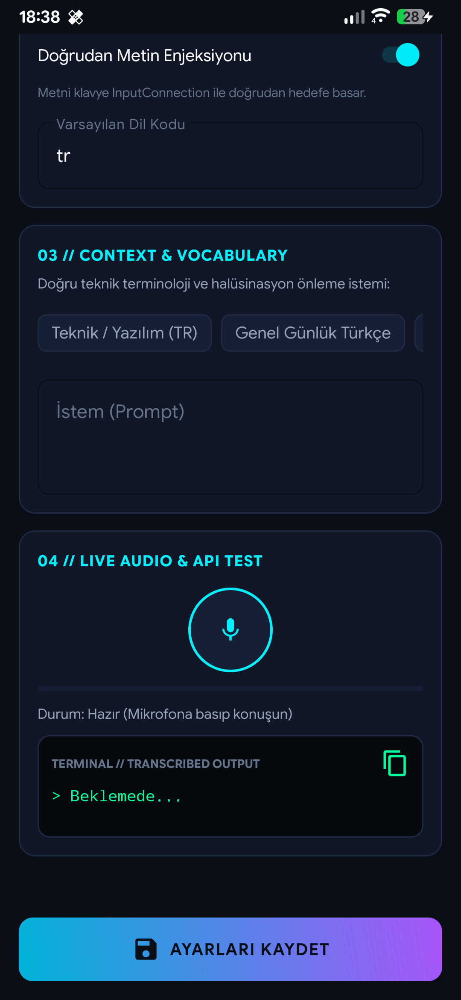
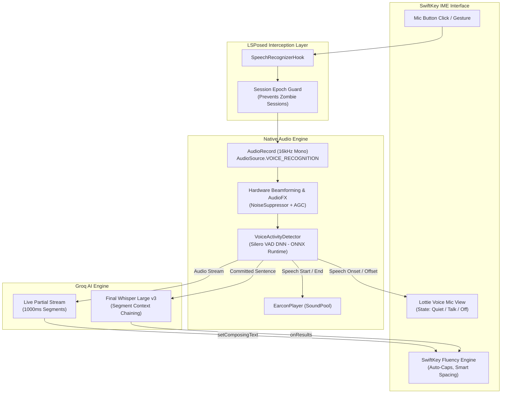

# 🎙️ SwiftKeyWhisper

**Next-Generation Whisper-Powered Voice Typing for Microsoft SwiftKey**

[-3DDC84?style=for-the-badge&logo=android&logoColor=white)](https://developer.android.com/)

 

*Replace traditional cloud/device voice input with ultra-fast Groq Whisper AI while retaining 100% of SwiftKey's native fluency, grammar prediction, haptics, and Lottie animations.*

[Features](#-key-features) • [Screenshots](#-screenshots) • [Architecture](#-architecture--data-flow) • [Quick Start](#-quick-start) • [Configuration](#-configuration) • [Security](#-security--privacy)

---

## 🌟 Overview

**SwiftKeyWhisper** is a lightweight LSPosed module that seamlessly redirects Microsoft SwiftKey's internal `SpeechRecognizer` pipeline to the state-of-the-art **OpenAI Whisper Large v3** model hosted on **Groq Cloud**.

Instead of treating voice input as a separate detached keyboard overlay, SwiftKeyWhisper hooks directly into the core IME pipeline. It allows users to dictate seamlessly at human conversational speed with near-instantaneous (~250ms) streaming partial feedback, zero transcription stutter, and perfect Turkish/English mixed technical phrase comprehension.

---

## 📱 Screenshots

  
  &nbsp;&nbsp;&nbsp;&nbsp;&nbsp;&nbsp;
  
  
<em>SwiftKeyWhisper Material 3 Companion App: Real-time status, model selection, live audio visualizer, and sub-second latency profiling.</em>

---

## ⚡ Key Features

<table>
<tr>
<td width="50%">

### 🚀 Ultra-Low Latency Streaming
* **Groq LPU Hardware Acceleration:** Leveraging Whisper Large v3 inference with sub-350ms turnaround times.
* **Live Word Streaming:** Real-time partial transcriptions flow directly into SwiftKey's active composing region (`setComposingText`) as you speak.

</td>
<td width="50%">

### 🧠 Native Fluency Engine Integration
* **Preserved Predictions & Learning:** Dictated text is processed through SwiftKey's native language models, retaining automatic capitalization, dynamic spacing, punctuation corrections, and personal dictionary learning.

</td>
</tr>
<tr>
<td width="50%">

### 🎙️ Hardware Dual-Mic Beamforming
* **`AudioSource.VOICE_RECOGNITION`:** Harnesses device multi-microphone arrays (e.g., Qualcomm Fluence DSP) to isolate the speaker's voice and hardware-attenuate ambient sound.
* **AudioFX Integration:** Proactively attaches `NoiseSuppressor` and `AutomaticGainControl` to balance far-field whisper and loud speech.

</td>
<td width="50%">

### 🧠 On-Device Silero VAD (Deep Neural Network)
* **Deep Neural Network Voice Activity Detection:** Powered by Microsoft ONNX Runtime Mobile and Silero VAD DNN. Distinguishes human speech from ambient traffic, cafe chatter, and background noise with >99% accuracy.
* **Pre-Warmed 0ms Singleton:** Model is pre-warmed in memory upon IME launch, eliminating cold-start delay for instant mic response.

</td>
</tr>
<tr>
<td width="50%">

### 🎨 Synchronized Lottie State Machine
* **Frame-Accurate Mic Visuals:** Synchronizes SwiftKey's `LottieVoiceMicrophoneView` states (`VOICE_OFF`, `VOICE_QUIET`, `VOICE_TALK`) with real-time speech activity and cancellation events.

</td>
<td width="50%">

### 🔔 Native Dictation Earcons & Volume Control
* **Authentic Audio Cues:** Includes original start/stop acoustic earcons powered by `SoundPool` with customizable volume (0-100%).
* **Ringer-Aware:** Strictly respects Android system silent and vibration profiles (`USAGE_ASSISTANCE_SONIFICATION`).

</td>
</tr>
</table>

---

## 🏗️ Architecture & Data Flow

SwiftKeyWhisper intercepts voice recognition at the application boundary and processes audio through a multi-stage streaming pipeline:

---

## 📲 Quick Start

### Requirements
* Android 7.0 – 16 (Tested and verified on Android 16)
* Root access via Magisk, KernelSU, or APatch
* [LSPosed Framework](https://github.com/LSPosed/LSPosed) installed and active
* [Microsoft SwiftKey Keyboard](https://play.google.com/store/apps/details?id=com.touchtype.swiftkey) (Tested on `v9.13.14.5`)
* A free [Groq Cloud API Key](https://console.groq.com/keys)

### Installation

1. **Download the APK:**
   * Grab the latest pre-built signed APK from the [Releases](https://github.com/MematiBas42/swiftkey-whisper/releases/latest) page (`SwiftKeyWhisper-vX.X.X.apk`).
2. **Enable in LSPosed:**
   * Open the LSPosed Manager.
   * Locate **SwiftKeyWhisper** under the Modules tab.
   * Enable the module and ensure **Microsoft SwiftKey** (`com.touchtype.swiftkey`) is selected in the scope.
3. **Configure API Key:**
   * Open the **SwiftKeyWhisper** companion app from your launcher.
   * Enter your **Groq API Key**.
   * Customize language, silence timeout, and audio cues to your preference.
   * Tap **Save Settings**.
4. **Enjoy Seamless Dictation:**
   * Open any app, bring up SwiftKey, and tap the microphone icon.

---

## ⚙️ Configuration

SwiftKeyWhisper provides a Material 3 companion interface and a direct JSON configuration file:

| Option | Key | Default | Description |
| :--- | :--- | :---: | :--- |
| **API Key** | `api_key` | *None* | Your Groq Cloud API Key (`gsk_...`). |
| **Model** | `model` | `whisper-large-v3` | Groq Whisper model endpoint. |
| **Language** | `language` | `en` | Fallback language code (`en`, `tr`, etc.). Supports auto-detection. |
| **Auto Language** | `auto_language` | `true` | Matches keyboard's active input language dynamically. |
| **Prompt / Context** | `prompt` | `""` | Initial prompt for Whisper context and vocabulary steering. |
| **Silence Timeout** | `silence_timeout_ms` | `750 ms` | Duration of silence before finalizing sentence segment via Silero VAD. |
| **Auto Stop Timeout** | `auto_stop_timeout_ms` | `1500 ms` | Duration of silence before automatically ending session to static mic (0 to disable / continuous). |
| **Live Streaming** | `streaming_enabled` | `true` | Enables real-time partial word streaming while speaking. |
| **Partial Interval** | `partial_interval_ms`| `1000 ms` | Frequency of intermediate streaming requests. |
| **Sound Effects** | `sound_effects_enabled` | `true` | Plays low-latency start/stop dictation earcons. |
| **Earcon Volume** | `earcon_volume` | `100%` | Relative volume slider (0-100%) for acoustic cues, respecting ringer mode. |

> **Cross-Process Storage:** Settings are securely stored in module preferences and synchronized in real-time across process boundaries with microsecond latency using modern LibXposed `RemotePreferences`. All preferences and credentials are automatically purged by Android when the app is uninstalled.

---

## 🔒 Security & Privacy

* **Zero Hardcoded Secrets & Clean Uninstallation:** No API keys or private tokens are embedded in the APK binary. Keys are stored strictly within Android module `SharedPreferences` (`swiftkey_whisper_prefs.xml`), which Android automatically purges when the companion app is uninstalled.
* **Direct Cloud Ingestion:** Audio recordings are processed in-memory as PCM byte buffers, converted directly to WAV, and sent to Groq Cloud over TLS 1.3 encryption. No unencrypted audio files are saved to permanent disk storage.

---

## 🤝 Contributing

Contributions, issues, and feature requests are welcome! Feel free to check the [issues page](https://github.com/MematiBas42/swiftkey-whisper/issues).

1. Fork the repository
2. Create your feature branch (`git checkout -b feature/amazing-feature`)
3. Commit your changes (`git commit -m 'feat: Add amazing feature'`)
4. Push to the branch (`git push origin feature/amazing-feature`)
5. Open a Pull Request

---

## 📄 License

This project is licensed under the **Apache License 2.0** - see the [LICENSE](LICENSE) file for details.

  Crafted with precision for enthusiasts who demand flawless voice dictation on Android.

